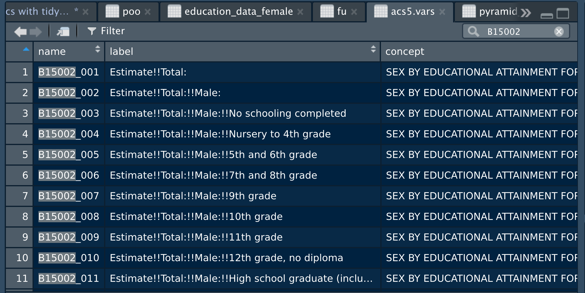

# Introduction

For a general overview of what we will refer to generically as "Census Data" see the information from the Demographics Research Group at the University of Virginia at

-   [https://demographics.](https://demographics.coopercenter.org/guide-to-publicly-available-demographic-data/){.uri}[coopercenter](https://demographics.coopercenter.org/guide-to-publicly-available-demographic-data/){.uri}[.org/guide-to-publicly-available-demographic-data/](https://demographics.coopercenter.org/guide-to-publicly-available-demographic-data/){.uri}

and the book, *Data Wrangling*, by Altman, Behrman, and Wickham which available free at

-   <https://dcl-wrangle.stanford.edu/census.html>

Here is a guide to all of the API's available from the US Census

-   <https://www.census.gov/data/developers/data-sets.html>

So you are aware, to build this lesson on "tidycensus" I am closely following the description at

-   <https://walker-data.com/tidycensus/>.

This Walker person is the person who created tidycensus. He has a whole online book on doing analyses with Census data in R.

-   <https://walker-data.com/census-r/>

Another useful website

-   <https://censusreporter.org/>

It is probably a good idea for you to create a folder of bookmarks on your browser and save these. We will come back to them regularly.

# Getting started

To get started working with tidycensus, users should load the package along with the tidyverse package, and set their Census API key. A key can be obtained from <http://api.census.gov/data/key_signup.html>. The Census key included below is MINE... get your own!! We'll talk more about API's later in the semester. You'll also hear about them in BAIS 396.

```{r setup, message=FALSE,warning=FALSE}
knitr::opts_chunk$set(
	echo = TRUE,
	message = FALSE,
	warning = FALSE
)
library(tidycensus)
library(tidyverse)

census_api_key("fa67b1dbacf4fbbb1b14c875f34437c6cbdaa694")
```

\newpage

# Median age by state

So let's demonstrate how cool and easy this can be. We'll look in the 2020 US Census data and grab the median age for each state. It's important to note that we haven't downloaded the entire US Census data set. That would be insane. We are using the API to go to the US Census servers and grab exactly the data that we want to use.

```{r}
age20 <- get_decennial(geography = "state", 
                       variables = "P13_001N", 
                       year = 2020,
                       sumfile = "dhc")
```

We have the data now, so what do we do with it? We plot it somehow to see if there's anything interesting in there. How? Use ggplot().

```{r}
age20 %>%
  ggplot(aes(x = value, y = reorder(NAME, value))) + 
  geom_point()+
  labs(x="Median age", y = "")
```

\newpage

# Searching for variables

The first question that should have come to mind, "Where in the world did \`\`P13_001N'' come from?"\
The answer to this question kind of sucks. Here is what <https://walker-data.com/tidycensus/> tells us about about this.

> Getting variables from the Census or ACS requires knowing the variable ID - and there are thousands of these IDs across the different Census files. To rapidly search for variables, use the load_variables() function. The function takes two required arguments: the year of the Census or endyear of the ACS sample, and the dataset name, which varies in availability by year. For the decennial Census, possible dataset choices include "pl" for the redistricting files; "dhc" for the Demographic and Housing Characteristics file and "dp" for the Demographic Profile (2020 only), and "sf1" or "sf2" (2000 and 2010) and "sf3" or "sf4" (2000 only) for the various summary files. Special island area summary files are available with "as", "mp", "gu", or "vi".

> For the ACS, use either "acs1" or "acs5" for the ACS detailed tables, and append /profile for the Data Profile and /subject for the Subject Tables. To browse these variables, assign the result of this function to a variable and use the View function in RStudio. An optional argument cache = TRUE will cache the dataset on your computer for future use.

```{r}
dhc.vars <- load_variables(2020, "dhc", cache = TRUE)
```

We can then view "dhc.vars" like we view any table in R with View(dhc.vars) which isn't super encouraging because it's a table that has over 9,000 rows. At this point, we take advantage of the search bar that is available in the Viewer to search for the phrase "median age." Doing so, we find that the code \`\`P13_001N'' gives us the median age for both sexes.

\newpage

# Same graphic, but with total population by states

```{r echo=FALSE}
pop20 <- get_decennial(geography = "state", 
                       variables = "P1_001N", 
                       year = 2020,
                       sumfile = "dhc")

pop20 %>%
  ggplot(aes(x = value, y = reorder(NAME, value))) + 
  geom_point()+
  labs(x="Total Population", y = "")
```

\newpage

# Age distributions

We saw earlier that Utah has the youngest median age and Maine has the highest median age (excluding Puerto Rico). In MATH 256 though, you learn about how any summary statistic (i.e. mean, median, mode, etc) only gives are partial picture. Let's see how we could compare the entire age distributions of these two states. Also, we'll use the ACS data instead of the decennial Census because it is the one that will give us more detailed information (e.g. income, education, religion, etc.).

```{r}
acs5.vars <- load_variables(2021, "acs5")
subject <- load_variables(2021, "acs5/subject")
```

This is still a little bit rough for me to figure out. It's a little easier for me to scroll through Census variable names on the website for the Census API at <https://api.census.gov/data/2021/acs/acs5/variables.html>.

\newpage

```{r}
cohort_names <- c("0-4", "5-9", "10-14", "15-19",
                  "20-24", "25-29", "30-34", "35-39",
                  "40-44", "45-49", "50-54", "55-59",
                  "60-64", "65-69", "70-74", "75-79",
                  "80-84", "85+")

male_vars <- 2:19 %>%
  str_pad(2, "left", "0") %>%
  paste0("S0101_C03_0", .) %>%
  set_names(cohort_names)

female_vars <- 2:19 %>%
  str_pad(2, "left", "0") %>%
  paste0("S0101_C05_0", .) %>%
  set_names(cohort_names)

male_data <- get_acs(
  geography = "state",
  variables = male_vars,
  state = "UT",
  year = 2021
) %>%
  mutate(sex = "Male",
         estimate = estimate * -1)

female_data <- get_acs(
  geography = "state",
  variables = female_vars,
  state = "UT",
  year = 2021
) %>%
  mutate(sex = "Female")

pyramid_data <- bind_rows(male_data, female_data) %>%
  mutate(variable = factor(variable, levels = cohort_names))

ggplot(pyramid_data, 
       aes(x = estimate, y = variable, 
           fill = sex)) + 
  geom_col(width = 0.95, alpha = 0.75) + 
  theme_minimal(base_size = 18) + 
  scale_x_continuous(labels = function(x) paste0(abs(x / 1000), "k")) + 
  scale_fill_manual(values = c("red", "navy blue")) + 
  labs(x = "", 
       y = "ACS estimate", 
       title = "Population structure in Utah", 
       fill = "", 
       caption = "Data source: 2017-2021 ACS & tidycensus R package")

```

\newpage

Now do the same graphs, but compare Utah's population structure to Maine's.

```{r echo=FALSE}
cohort_names <- c("0-4", "5-9", "10-14", "15-19",
                  "20-24", "25-29", "30-34", "35-39",
                  "40-44", "45-49", "50-54", "55-59",
                  "60-64", "65-69", "70-74", "75-79",
                  "80-84", "85+")

male_vars <- 2:19 %>%
  str_pad(2, "left", "0") %>%
  paste0("S0101_C03_0", .) %>%
  set_names(cohort_names)

female_vars <- 2:19 %>%
  str_pad(2, "left", "0") %>%
  paste0("S0101_C05_0", .) %>%
  set_names(cohort_names)

male_data <- get_acs(
  geography = "state",
  variables = male_vars,
  state = c("UT","ME"),
  year = 2021
) %>%
  mutate(sex = "Male",
         estimate = estimate * -1)

female_data <- get_acs(
  geography = "state",
  variables = female_vars,
  state = c("UT","ME"),
  year = 2021
) %>%
  mutate(sex = "Female")

pyramid_data <- bind_rows(male_data, female_data) %>%
  mutate(variable = factor(variable, levels = cohort_names))

ggplot(pyramid_data, 
       aes(x = estimate, y = variable, 
           fill = sex)) + 
  geom_col(width = 0.95, alpha = 0.75) + 
  theme_minimal(base_size = 18) + 
  scale_x_continuous(labels = function(x) paste0(abs(x / 1000), "k")) + 
  scale_fill_manual(values = c("red", "navy blue")) + 
  facet_wrap(~NAME,scale="free")+
  labs(x = "", 
       y = "ACS estimate", 
       title = "Population structures of Utah and Maine", 
       fill = "", 
       caption = "Data source: 2017-2021 ACS & tidycensus R package")
```

\newpage

Can you do this for Hamilton County?

```{r echo=FALSE}
cohort_names <- c("0-4", "5-9", "10-14", "15-19",
                  "20-24", "25-29", "30-34", "35-39",
                  "40-44", "45-49", "50-54", "55-59",
                  "60-64", "65-69", "70-74", "75-79",
                  "80-84", "85+")

male_vars <- 2:19 %>%
  str_pad(2, "left", "0") %>%
  paste0("S0101_C03_0", .) %>%
  set_names(cohort_names)

female_vars <- 2:19 %>%
  str_pad(2, "left", "0") %>%
  paste0("S0101_C05_0", .) %>%
  set_names(cohort_names)

male_data <- get_acs(
  geography = "county",
  variables = male_vars,
  state = "OH",
  county = "Hamilton",
  year = 2021
) %>%
  mutate(sex = "Male",
         estimate = estimate * -1)

female_data <- get_acs(
  geography = "county",
  variables = female_vars,
  state = "OH",
  county = "Hamilton",
  year = 2021
) %>%
  mutate(sex = "Female")

pyramid_data <- bind_rows(male_data, female_data) %>%
  mutate(variable = factor(variable, levels = cohort_names))

ggplot(pyramid_data, 
       aes(x = estimate, y = variable, 
           fill = sex)) + 
  geom_col(width = 0.95, alpha = 0.75) + 
  theme_minimal(base_size = 18) + 
  scale_x_continuous(labels = function(x) paste0(abs(x / 1000), "k")) + 
  scale_fill_manual(values = c("red", "navy blue")) + 
  labs(x = "", 
       y = "ACS estimate", 
       title = "Population structure in Hamilton County", 
       fill = "", 
       caption = "Data source: 2017-2021 ACS & tidycensus R package")
```

\newpage

Here's the big one. Can you do this for the City of Cincinnati? The answer is probably "No", at least at first.

```{r echo = FALSE}
cohort_names <- c("0-4", "5-9", "10-14", "15-19",
                  "20-24", "25-29", "30-34", "35-39",
                  "40-44", "45-49", "50-54", "55-59",
                  "60-64", "65-69", "70-74", "75-79",
                  "80-84", "85+")

male_vars <- 2:19 %>%
  str_pad(2, "left", "0") %>%
  paste0("S0101_C03_0", .) %>%
  set_names(cohort_names)

female_vars <- 2:19 %>%
  str_pad(2, "left", "0") %>%
  paste0("S0101_C05_0", .) %>%
  set_names(cohort_names)

male_data <- get_acs(
  geography = "county subdivision",
                 state = "Ohio",
                 county = "Hamilton",
  variables = male_vars,
  year = 2021
) %>%
  filter(NAME == "Cincinnati city, Hamilton County, Ohio") %>%
  mutate(sex = "Male",
         estimate = estimate * -1)

female_data <- get_acs(
  geography = "county subdivision",
                 state = "Ohio",
                 county = "Hamilton",
  variables = female_vars,
  year = 2021
) %>%
  filter(NAME == "Cincinnati city, Hamilton County, Ohio") %>%
  mutate(sex = "Female")

pyramid_data <- bind_rows(male_data, female_data) %>%
  mutate(variable = factor(variable, levels = cohort_names))

ggplot(pyramid_data, 
       aes(x = estimate, y = variable, 
           fill = sex)) + 
  geom_col(width = 0.95, alpha = 0.75) + 
  theme_minimal(base_size = 18) + 
  scale_x_continuous(labels = function(x) paste0(abs(x / 1000), "k")) + 
  scale_fill_manual(values = c("red", "navy blue")) + 
  labs(x = "", 
       y = "ACS estimate", 
       title = "Population structure in Cincinnati", 
       fill = "", 
       caption = "Data source: 2017-2021 ACS & tidycensus R package")
```

\newpage

# Household Income

It sucks to actually do (maybe you all can actually figure out a better way to do these things and teach me), but in the \`\`subject'' dataframe you can eventually find data on the number of households with particular household incomes.


\newpage

Let's make a plot of the distribution of household incomes in the city.

```{r}
group_names <- c("$0 to $10,000",
                 "$10,000 to $14,999",
                 "$15,000 to $24,999",
                 "$25,000 to $34,999",
                 "$35,000 to $49,999",
                 "$50,000 to $74,999",
                 "$75,000 to $99,999",
                 "$100,000 to $149,999",
                 "$150,000 to $199,999",
                 "$200,000 or more")

income_vars <- 2:11 %>%
  str_pad(2, "left", "0") %>%
  paste0("S0101_C01_0", .) %>%
  set_names(group_names)

income_data <- get_acs(
  geography = "county subdivision",
                 state = "Ohio",
                 county = "Hamilton",
  variables = income_vars,
  year = 2021
) %>%
  filter(NAME == "Cincinnati city, Hamilton County, Ohio")

ggplot(income_data, aes(x=factor(variable, level = group_names),y=estimate))+
  geom_col() +
  coord_flip()+
   labs(x = "Household Income", 
       y = "Number of Households", 
       title = "Household Income in Cincinnati", 
       fill = "", 
       caption = "Data source: 2017-2021 ACS & tidycensus R package")

```

\newpage

# Race

Let's look at the racial makeup of Cincinnati.

```{r}
race_data <- get_acs(
  geography = "county subdivision",
  variables = c(
    white = "B03002_003",
    black = "B03002_004",
    asian = "B03002_006",
    "two or more" = "B03002_009",
    hispanic = "B03002_012"
  ), 
  state = "OH",
  county= "Hamilton",
  year = 2021
) %>%
  filter(NAME == "Cincinnati city, Hamilton County, Ohio") 


ggplot(race_data, aes(x=reorder(variable, estimate),y=estimate))+
  geom_col() +
  coord_flip()+
   labs(x = "Race", 
       y = "Number of Individuals", 
       title = "Race in Cincinnati", 
       fill = "", 
       caption = "Data source: 2017-2021 ACS & tidycensus R package")
```

\newpage

## Educational Attainment

Let's look at educational attainment in Cincinnati.



```{r}

og_ed_names <- c("No schooling", "Nursery to 4th grade", "5th-6th", "7th-8th",
              "9th", "10th", "11th", "12th, no diploma",
              "High School graduate", "Some college <1yr", 
              "Some colleage >1ur", "Associate's degree",
              "Bachelor's degree", "Master's degree", 
              "Professional School degree", "Doctrate degree")

ed_names <- c('No degree','High school','Some college',
              'Associates','Bachelors','Post-grad')

male_vars <- 3:18 %>%
  str_pad(2, "left", "0") %>%
  paste0("B15002_0", .) %>%
  set_names(og_ed_names)

female_vars <- 20:35 %>%
  str_pad(2, "left", "0") %>%
  paste0("B15002_0", .) %>%
  set_names(og_ed_names)

education_data_male <- get_acs(
  geography = "county subdivision",
  variables = male_vars,
  state = "OH",
  county= "Hamilton",
  year = 2021
) %>%
  filter(NAME == "Cincinnati city, Hamilton County, Ohio") 

education_data_female <- get_acs(
  geography = "county subdivision",
  variables = female_vars,
  state = "OH",
  county= "Hamilton",
  year = 2021
) %>%
  filter(NAME == "Cincinnati city, Hamilton County, Ohio") 

poo <-
  inner_join(education_data_male,education_data_female,
             by=c('GEOID','NAME','variable'),suffix=c(".m",".f")) %>% 
  mutate(estimate = estimate.m+estimate.f) %>% 
  select(c('GEOID','NAME',"variable","estimate")) %>% 
  pivot_wider(, names_from = variable,values_from = estimate ) %>% 
  mutate(`No degree` = `No schooling`
              +`Nursery to 4th grade`+`5th-6th`+`7th-8th`
              +`9th`+`10th`+`11th`+`12th, no diploma`,
         `High school`=`High School graduate`,
         `Some college` = `Some college <1yr`+`Some colleage >1ur`,
         Associates = `Associate's degree`,
         Bachelors = `Bachelor's degree`,
         `Post-grad` = `Master's degree`
         +`Professional School degree`
         +`Doctrate degree`) %>% 
  select(c(GEOID,NAME,ed_names)) %>% 
  pivot_longer(cols=ed_names,names_to = 'variable',values_to = 'estimate') %>% 
  mutate(variable = factor(variable, levels = ed_names))


ggplot(poo, aes(x=variable,y=estimate))+
  geom_col() +
  coord_flip()+
   labs(x = "Educational Attainment", 
       y = "Number of Individuals", 
       title = "Education level in Cincinnati", 
       fill = "", 
       caption = "Data source: 2017-2021 ACS & tidycensus R package")
```

\newpage

\
\newpage

# Various dumb things I tried that didn't work out

```{r eval=FALSE}
males <- get_acs(geography = "state",
               state = c("Maine", "Utah"),
               variables = c("age 0 to 4"= "B01001_003",
                             "age 5 to 9"= "B01001_004",
                             "age 10 to 14"= "B01001_005",
                             "age 15 to 17"= "B01001_006",
                             "age 18 to 19"= "B01001_007",
                             "age 20"= "B01001_008",
                             "age 21"= "B01001_009",
                             "age 22 to 24"= "B01001_010",
                             "age 25 to 29"= "B01001_011",
                             "age 30 to 34"= "B01001_012",
                             "age 35 to 39"= "B01001_013",
                             "age 40 to 44"= "B01001_014",
                             "age 45 to 49"= "B01001_015",
                             "age 50 to 54"= "B01001_016",
                             "age 55 to 59"= "B01001_017",
                             "age 60 to 61"= "B01001_018",
                             "age 62 to 64"= "B01001_019",
                             "age 65 to 66"= "B01001_020",
                             "age 67 to 69"= "B01001_021",
                             "age 70 to 74"= "B01001_022",
                             "age 75 to 79"= "B01001_023",
                             "age 80 to 84"= "B01001_024",
                             "age 85 and over"= "B01001_025"
               ),
               year = 2021,
               sumfile = "acs5") %>%
  mutate("age 15 to 19" = ~"age 15 to 17"+~"age 17 to 19")


 "Female Total"= "B01001_026",
                             "Female age 0 to 4"= "B01001_027",
                             "Female age 5 to 9"= "B01001_028",
                             "Female age 10 to 14"= "B01001_029",
                             "Female age 15 to 17"= "B01001_030",
                             "Female age 18 to 19"= "B01001_031",
                             "Female age 20"= "B01001_032",
                             "Female age 21"= "B01001_033",
                             "Female age 22 to 24"= "B01001_034",
                             "Female age 25 to 29"= "B01001_035",
                             "Female age 30 to 34"= "B01001_036",
                             "Female age 35 to 39"= "B01001_037",
                             "Female age 40 to 44"= "B01001_038",
                             "Female age 45 to 49"= "B01001_039",
                             "Female age 50 to 54"= "B01001_040",
                             "Female age 55 to 59"= "B01001_041",
                             "Female age 60 to 61"= "B01001_042",
                             "Female age 62 to 64"= "B01001_043",
                             "Female age 65 to 66"= "B01001_044",
                             "Female age 67 to 69"= "B01001_045",
                             "Female age 70 to 74"= "B01001_046",
                             "Female age 75 to 79"= "B01001_047",
                             "Female age 80 to 84"= "B01001_048",
                             "Female age 85 and over"= "B01001_049"


compare <- filter(poo, !str_detect(variable,"Total")) %>%
  mutate(SEX = ifelse(str_detect(variable,"Male"),"Male","Female")) %>%
  mutate(estimate = ifelse(SEX == "Male", -estimate, estimate))

ggplot(compare, aes(x = variable, y = estimate, fill = SEX)) +
  geom_col(width = 1) +
  theme_minimal(base_family = "Verdana", base_size = 12) +
  scale_y_continuous(labels = function(y) paste0(abs(y / 1000), "k")) +
  scale_x_discrete(labels = function(x) gsub("Female age","",gsub("Male age", "", x))) +
  scale_fill_manual(values = c("darkred", "navy")) +
  coord_flip() +
  facet_wrap(~NAME,scales="free") +
  labs(x = "",
       y = "2021 American Community Survey  population estimate",
       title = "Population structure for Maine and Utah",
       fill = "",
       caption = "Data source: US Census Bureau population estimates & tidycensus R package")
```

Our campaigns are just in the City of Cincinnati though. Let's do an age pyramid for Cincinnati residents.

```{r eval=FALSE}
 poo <- get_estimates(geography = "county subdivision",
                      state = "Ohio",
                      county = "Hamilton",
                      product = "characteristics",
                      breakdown = c("SEX", "AGEGROUP"),
                      breakdown_labels = TRUE,
                      year = 2019)

 compare <- filter(poo, str_detect(AGEGROUP, "^Age"),
                   SEX != "Both sexes") %>%
   mutate(value = ifelse(SEX == "Male", -value, value))

ggplot(compare, aes(x = AGEGROUP, y = value, fill = SEX)) +
  geom_bar(stat = "identity", width = 1) +
  scale_y_continuous(labels = function(y) paste0(abs(y / 1000), "k")) +
  scale_x_discrete(labels = function(x) gsub("Age | years", "", x)) +
  scale_fill_manual(values = c("darkred", "navy")) +
  coord_flip() +
  facet_wrap(~NAME) +
  labs(x = "",
       y = "2019 Census Bureau population estimate",
       title = "Population structure for Maine and Utah",
       fill = "",
       caption = "Data source: US Census Bureau population estimates & tidycensus R package")
```
