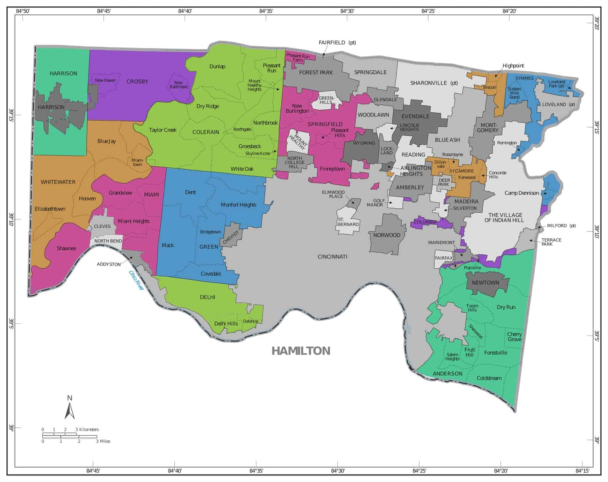
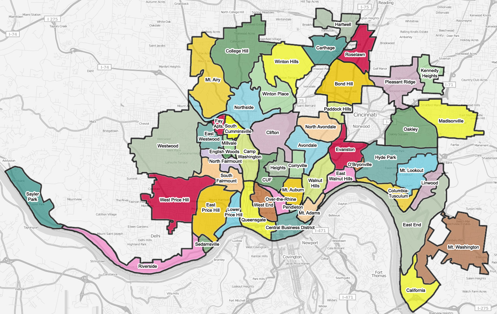

# Setup

```{r packages, echo=FALSE, results='hide', message=FALSE, warning=FALSE}
library(dplyr)
library(tidyr)
library(xml2)
library(tidyverse)
library(purrr)
library(sf)
library(RColorBrewer)
library(ggnewscale)
library(gridExtra)
library(grid)
library(cowplot)
```

Function that parses the xml results files.

```{r load-functions}
parse_contest_results <- function(xml_file){
  
  ## Get all Contest nodes
  contests <- xml_file %>% xml_find_all(".//Contest")
  
  # Function to extract vote data for each contest and candidate
  parse_contest_votes <- function(contest_node) {
    contest_name <- xml_attr(contest_node, "text")
    
    # Get all candidate (Choice) nodes
    choices <- contest_node %>% xml_find_all(".//Choice")
    
    # Iterate through each candidate
    map_df(choices, function(choice) {
      candidate_name <- xml_attr(choice, "text")
      
      # Get all VoteType nodes (Early, Election)
      vote_types <- choice %>% xml_find_all(".//VoteType")
      
      # Iterate through each VoteType and precinct data
      map_df(vote_types, function(vote_type) {
        vote_type_name <- xml_attr(vote_type, "name")
        
        # Extract precincts
        precincts <- vote_type %>% xml_find_all(".//Precinct")
        
        # For each precinct, extract the votes and precinct name
        map_df(precincts, function(precinct) {
          precinct_name <- xml_attr(precinct, "name")
          votes <- xml_attr(precinct, "votes") %>% as.numeric()
          
          tibble(
            contest = contest_name,
            candidate = candidate_name,
            vote_type = vote_type_name,
            precinct = precinct_name,
            votes = votes
          )
        })
      })
    })
  }
  
  # Apply the function to all contests
  election_data <- contests %>% map_df(parse_contest_votes)
  return(election_data)
}
```

A function to get turnout from the xml file

```{r}

turnout.df <- function(turnout.data){
  # Create a data frame
  turnout.df <- data.frame(
    name = xml_attr(turnout.data, "name"),
    totalVoters = as.integer(xml_attr(turnout.data, "totalVoters")),
    ballotsCast = as.integer(xml_attr(turnout.data, "ballotsCast")),
    voterTurnout = as.numeric(xml_attr(turnout.data, "voterTurnout")),
    percentReporting = as.numeric(xml_attr(turnout.data, "percentReporting")),
    stringsAsFactors = FALSE
  )
  return(turnout.df)
}
```

## Import election results and load comparisons

```{r -import, echo=FALSE, results='hide', message=FALSE, warning=FALSE}

namexml <- "current election/detail06.xml"

# Load the XML file and parse into a dataframe
election_data <- parse_contest_results(read_xml(namexml))
timestamp <- xml_text(xml_find_first(read_xml(namexml), "//Timestamp"))


# Turnout data comes in separatley
turnout_data <- read_xml(namexml) %>%
    xml_find_all("//Precincts/Precinct")
prec.turnout <- turnout.df(turnout_data)
NNN = nrow(prec.turnout)


reporting.precincts <- prec.turnout %>% 
  select(name,percentReporting) %>% 
  rename(reporting = percentReporting) %>% 
  mutate(reporting = recode(reporting, `1` = "Not reporting", `2` = "Partially Reported", `3` = "Don't know", `4` = "Completely Reported"))

## for testing purposes
#reporting.precincts$reporting = "Not Reporting"
#reporting.precincts$reporting[sample(1:NNN,250)] = "Completely Reported"
#reporting.precincts$reporting[sample(1:NNN,75)] = "Partially Reported"

## Map the comparison results, with overlay precinct colored by reporting status 
reporting_colors <- c(
  "Not Reporting" = "transparent",
  "Partially Reported" = "transparent",
  "Don't know" = "black",
  "Completely Reported" = "darkseagreen"
)

# Load the objects that results from pre-election preparation
load("ElectionNightComparisons.RData")

```

## Functions

A function to summarize the overall results of a head-to-head race.

```{r}
results.df <- function(my.race, my.dem, my.rep, election_data) {
  ## Take the total election results and sum up votes for Presidential candidates
  vote_sums <- election_data  %>%
    filter(contest == my.race) %>% 
    group_by(candidate, vote_type) %>%
    summarize(total = sum(votes, na.rm = TRUE),.groups="keep") %>% 
    pivot_wider(names_from = vote_type, values_from = total) %>% 
    mutate(Overall = rowSums(across(everything()))) %>% 
    ungroup()
  
  column_sums <- vote_sums %>%
    select(where(is.numeric)) %>%
    summarize(across(everything(), ~ sum(.x, na.rm = TRUE)))
  vote_sums <- vote_sums %>%
    add_row(candidate = "Total", !!!column_sums)
  
  ## Pull out the Democratic and Republican candidates and calculate their percentages
  dem.row = vote_sums %>% filter(candidate == my.dem)
  rep.row = vote_sums %>% filter(candidate == my.rep)
  tot.row = vote_sums %>% filter(candidate == 'Total')
  
  output = rbind(round(100*dem.row[2:4]/tot.row[2:4],1),round(100*rep.row[2:4]/tot.row[2:4],1))
  rownames(output) = c(my.dem,my.rep)
  
  return(output)
}
```

A function to get head-to-head election results by the precinct

```{r}
precinct.results.df <- function(my.race, my.dem, my.rep, election.data) {
  ## Get the precinct-by-precinct election results for Democrat and Republican in head-to-head race
  early <- election_data  %>%
    filter(contest == my.race,vote_type=='Early') %>% 
    group_by(precinct) %>%
    summarize(early = sum(votes, na.rm = TRUE),.groups="keep") 
  
  election <- election_data  %>%
    filter(contest == my.race,vote_type=='Election') %>% 
    group_by(precinct) %>%
    summarize(election = sum(votes, na.rm = TRUE),.groups="keep") 
  
  overall <- election_data  %>%
    filter(contest == my.race) %>% 
    group_by(precinct) %>%
    summarize(overall = sum(votes, na.rm = TRUE),.groups="keep")   
 
  dem.early <- election_data  %>%
    filter(contest == my.race,candidate==my.dem,vote_type=='Early') %>% 
    group_by(precinct) %>%
    summarize(dem.early = sum(votes, na.rm = TRUE),.groups="keep") 
  
  dem.election <- election_data  %>%
    filter(contest == my.race,candidate==my.dem,vote_type=='Election') %>% 
    group_by(precinct) %>%
    summarize(dem.election = sum(votes, na.rm = TRUE),.groups="keep") 
  
  dem.overall <- election_data  %>%
    filter(contest == my.race,candidate==my.dem) %>% 
    group_by(precinct) %>%
    summarize(dem.overall = sum(votes, na.rm = TRUE),.groups="keep") 
  
  rep.early <- election_data  %>%
    filter(contest == my.race,candidate==my.rep,vote_type=='Early') %>% 
    group_by(precinct) %>%
    summarize(rep.early = sum(votes, na.rm = TRUE),.groups="keep") 
  
  rep.election <- election_data  %>%
    filter(contest == my.race,candidate==my.rep,vote_type=='Election') %>% 
    group_by(precinct) %>%
    summarize(rep.election = sum(votes, na.rm = TRUE),.groups="keep") 
  
  rep.overall <- election_data  %>%
    filter(contest == my.race,candidate==my.rep) %>% 
    group_by(precinct) %>%
    summarize(rep.overall = sum(votes, na.rm = TRUE),.groups="keep")   
    
  output <-
    left_join(early,election,by='precinct') %>% 
    left_join(overall,by="precinct") %>% 
    left_join(dem.early,by="precinct") %>% 
    left_join(dem.election,by="precinct") %>% 
    left_join(dem.overall,by="precinct") %>% 
    left_join(rep.early,by="precinct") %>% 
    left_join(rep.election,by="precinct") %>% 
    left_join(rep.overall,by="precinct")
    
  return(output)
  }
```

A function that makes our graphics/page that compares current results to previous elections

```{r}

make.comparison.pages <- function(){
  graphic <- mapANDresults %>% 
    ggplot()+  
    geom_sf(data=st_union(mapANDresults),color="black",lwd=.7)+
    labs( fill = "", 
          caption = "") +
    geom_sf(data = mutate(mapANDresults,dem.prop.y = dem.overall.y/overall.y),aes(fill=dem.prop.y),color=NA) +
    scale_fill_gradientn(colours=brewer.pal(n=10,name="RdBu"),
                         na.value = "transparent",limits=c(0,1))+
    guides(fill = "none") +  # Remove the color bar
    new_scale_fill() +
    geom_sf(data = mapANDresults[top,],aes(fill=reporting),color=NA) +
    scale_fill_manual(values = reporting_colors,na.value = "transparent",breaks = c("Completely Reported","Partially Reported")) +
    #guides(fill = "none") +  # Remove the color bar
    geom_sf(data=st_union(mapANDresults[top,]),fill=NA,color="black",lwd=.4)+
    theme_void()+
    theme(legend.position = "bottom",   # Move legend to bottom
          legend.direction = "horizontal")+ # Arrange items horizontally
    guides(fill = guide_legend(title = NULL))  # This removes the title
  
  attach(mapANDresults)
  dem.now             = (sum(dem.early.x) + sum(dem.election.x[completely]))/(sum(early.x) +sum(election.x[completely]))
  dem.comp.now        = (sum(dem.early.y) + sum(dem.election.y[completely]))/(sum(early.y) +sum(election.y[completely]))
  dem.early.now       = sum(dem.early.x)                / sum(early.x) 
  dem.early.comp      = sum(dem.early.y)                / sum(early.y) 
  dem.completely.now  = sum(dem.election.x[completely]) / sum(election.x[completely]) 
  dem.completely.comp = sum(dem.election.y[completely]) / sum(election.y[completely]) 
  dem.partially.now   = sum(dem.election.x[partially]) / sum(election.x[partially]) 
  dem.partially.comp   = sum(dem.election.y[partially]) / sum(election.y[partially]) 
  dem.notreporting.comp= sum(dem.election.y[notreporting]) / sum(election.y[notreporting]) 
  dem.comp            = sum(dem.overall.y)          / sum(overall.y)
  rep.now             = (sum(rep.early.x) + sum(rep.election.x[completely]))/(sum(early.x) +sum(election.x[completely]))
  rep.comp.now        = (sum(rep.early.y) + sum(rep.election.y[completely]))/(sum(early.y) +sum(election.y[completely]))
  rep.early.now       = sum(rep.early.x)                / sum(early.x) 
  rep.early.comp      = sum(rep.early.y)                / sum(early.y) 
  rep.completely.now  = sum(rep.election.x[completely]) / sum(election.x[completely]) 
  rep.completely.comp = sum(rep.election.y[completely]) / sum(election.y[completely]) 
  rep.partially.now   = sum(rep.election.x[partially]) / sum(election.x[partially]) 
  rep.partially.comp   = sum(rep.election.y[partially]) / sum(election.y[partially]) 
  rep.notreporting.comp= sum(rep.election.y[notreporting]) / sum(election.y[notreporting]) 
  rep.comp            = sum(rep.overall.y)          / sum(overall.y)
  detach(mapANDresults)
  
  dem.table = data.frame(
    now = c(round(100*dem.early.now,1),round(100*dem.completely.now,1),round(100*dem.partially.now,1),"---","---"),
    comp = c(dem.early.comp,dem.completely.comp,dem.partially.comp,dem.notreporting.comp,dem.comp)
  ) %>%
    mutate(across(where(is.numeric), ~ round(. * 100,1)))
  colnames(dem.table) = dem.comp.col.names 
  
  rep.table = data.frame(
    now = c(round(100*rep.early.now,1),round(100*rep.completely.now,1),round(100*rep.partially.now,1),"---","---"),
    comp = c(rep.early.comp,rep.completely.comp,rep.partially.comp,rep.notreporting.comp,rep.comp)
  ) %>%
    mutate(across(where(is.numeric), ~ round(. * 100,1)))
  colnames(rep.table) = rep.comp.col.names 
  row.names(dem.table) = c("Early (all precincts)","Completely Reported","Partially Reported","Not Reporting","Final")
  row.names(rep.table) = c("Early (all precincts)","Completely Reported","Partially Reported","Not Reporting","Final")
  
  for (XX in c("DEM","REP")){
    if(XX == "DEM"){
      tab = tableGrob(dem.table) 
      comp.line = dem.comp.line
      comp.now = dem.comp.now
      now = dem.now
    }
    if (XX =="REP"){
      tab = tableGrob(rep.table) 
      comp.line = rep.comp.line
      comp.now = rep.comp.now
      now = rep.now
    }
    
    title = textGrob(paste('Current status compared to previous results\n',comp.line),gp = gpar(fontsize = 18,fontface='bold'))
    subtitle = textGrob( paste("as of",timestamp,"in same",length(completely),"/",NNN,"reporting precincts",sep =' '),gp = gpar(fontsize = 14))
    rightnow1 = textGrob(paste(round(100*now,1), '% / ', round(100*comp.now,1),"%",sep =''),gp = gpar(fontsize = 36))
    rightnow2 = textGrob(paste(comp.line), gp=gpar(fontsize=16,fontface="bold"))
    
    combined_output <- grid.arrange(
      title,
      subtitle,
      arrangeGrob(
        graphic,     # Left plot in the first column
        arrangeGrob(rightnow1,rightnow2,tab, ncol = 1,nrow=3,heights = c(0.2,0.1, 0.6)),  # Right column (two stacked plots)
        ncol = 2,
        widths = c(.5,.5)),
      nrow = 3,# One row, two columns
      heights = c(.2,.1,.8)
    )
  }
}
```

```{r}
make.change.graph <- function(){
  temp = mapANDresults %>% mutate(dem.diff= round(100*(dem.overall.x/overall.x - dem.overall.y/overall.y)),1)
  m = min(temp$dem.diff[completely])
  M = max(temp$dem.diff[completely])
  temp %>% 
    ggplot(aes())+  
    geom_sf(data=st_union(temp),fill=NA,color="black",lwd=.7)+
    labs(title = paste(my.race, "as of",timestamp,sep =' '),
         subtitle = "Change in Completely Reported precincts",
         fill = "", 
         caption = "") +
    geom_sf(data=temp[completely,],aes(fill=dem.diff),color=NA) +
    scale_fill_gradientn(colours=brewer.pal(n=10,name="RdBu"),
                         #values = scales::rescale(c(m, 0, M)),
                         na.value = "transparent",limits=c(m,M))+ 
    theme_void()
}
```

# Maps of Areas in Hamilton County

 

# Turnout

## Overall election turnout

```{r overall-turnout, fig.width=8, fig.height=4.5}
my.year = "2024"
#turnout_data = turnout.data.2020
#my.map = map2020
#my.name = "Turnout.2020"

prec.turnout <- turnout.df(turnout_data)

results <- left_join(map,prec.turnout,by=c("PRC_ID_NAME_short"="name")) %>% 
  left_join(st_drop_geometry(interpolated.results_Turnout.2020),
            by = c("PRECINCT"="PRECINCT"))

## Make a map of current voter turnout
m = min(results$ballotsCast.x/results$totalVoters.x)
M = max(results$ballotsCast.x/results$totalVoters.x)
results %>% 
  ggplot(aes(fill=ballotsCast.x/totalVoters.x)) +
  geom_sf()+
  labs(title = paste('Overall Election Voter Turnout as of ',timestamp,sep=''),
#  labs(title = paste('Overall Election Voter Turnout',my.year,sep = ", "),
       subtitle = "",
       fill = "", 
       caption = "")+
  scale_fill_gradientn(colours=rev(brewer.pal(n=10,name="Spectral")),na.value = "transparent",
                           breaks=c(0,.25,.50,.75,1),labels=c("0%","25%","50%","75%","100%"),
                           limits=c(0,1))+
  theme_void()


## Current precinct status
completely = which(results$reporting  == "Completely Reported")
partially = which(results$reporting  == "Partially Reported")
notreporting = which(results$reporting  == "Not Reporting")
bottom = which(results$reporting  == "Not Reporting")
top = which(results$reporting != "Not Reporting")


## Make a map of change in voter turnout from 2020
temp =results %>% mutate(turnout.diff= round(100*(ballotsCast.x/totalVoters.x - ballotsCast.y/totalVoters.y)),1)
  m = min(temp$turnout.diff[completely])
  M = max(temp$turnout.diff[completely])
temp %>% 
    ggplot(aes())+  
    geom_sf(data=st_union(temp),fill=NA,color="black",lwd=.7)+
    labs(title = paste("Change in Voter Turnout as of",timestamp,sep =' '),
         subtitle = "Change in Turnout in the Completely Reported precincts",
         fill = "", 
         caption = "") +
    geom_sf(data=temp[completely,],aes(fill=turnout.diff),color=NA) +
    scale_fill_gradientn(colours=brewer.pal(n=10,name="PRGn"),
                         values = scales::rescale(c(m, 0, M)),
                         na.value = "transparent",limits=c(m,M))+ 
    theme_void()

```

# Contests and Candidates

Print out all Contest/Candidates to be able to pull appropriate data

```{r}
print("-------2024-------")
print(unique(election_data$contest))
print(unique(election_data$candidate))
```

## Harris vs. Trump

```{r harris-v-trump, fig.width=8, fig.height=4.5}
my.year = "2024"
my.race = "For President and Vice President" 
my.dem = "For President\r\nKamala D. Harris\r\nFor Vice President\r\nTim Walz"
my.dem.short = "Kamala D. Harris / Tim Walz"
my.dem.veryshort = "Harris"
my.rep = "For President\r\nDonald J. Trump\r\nFor Vice President\r\nJD Vance" 
my.rep.short = "Donald J. Trump / JD Vance"
my.name = "Harris.v.Trump.2024"
my.rep.veryshort = "Trump"
dem.comp.col.names  = c('Harris\n2024','Biden\n2020')
rep.comp.col.names  = c('Trump\n2024','Trump\n2020')
dem.comp.line = c("Harris 2024 / Biden 2020")
rep.comp.line = c("Trump 2024 / Trump 2020")
interp.results = interpolated.results_Biden.v.Trump.2020


overall.results <- results.df(my.race,my.dem,my.rep,election_data)
rownames(overall.results) = c(my.dem.short,my.rep.short)
print(overall.results)

prec.results <- precinct.results.df(my.race,my.dem,my.rep,election_data)
mapANDresults <- left_join(map,prec.results,by=c("PRC_ID_NAME_short"="precinct"))%>%   ## sends mapANDresults back to global workspace
  left_join(st_drop_geometry(interp.results),
            by = c("PRECINCT"="PRECINCT")) %>% 
  left_join(reporting.precincts,by=c("PRC_ID_NAME_short" ="name"))

## Current precinct status
completely = which(mapANDresults$reporting  == "Completely Reported")
partially = which(mapANDresults$reporting  == "Partially Reported")
notreporting = which(mapANDresults$reporting  == "Not Reporting")
bottom = which(mapANDresults$reporting  == "Not Reporting")
top = which(mapANDresults$reporting != "Not Reporting")

## Map the current results only 
mapANDresults %>% 
  mutate(dem.prop.x = dem.overall.x/overall.x) %>%
  ggplot(aes(fill=dem.prop.x)) +
  geom_sf()+
  labs(title = paste(my.race, "as of",timestamp,sep =' '),
       subtitle = paste(my.dem.short, 'vs',my.rep.short,sep=' '),
       fill = "", 
       caption = "") +
  scale_fill_gradientn(colours=brewer.pal(n=10,name="RdBu"),
                       na.value = "transparent",
                       breaks=c(0,.25,0.5,.75,1),
                       labels=c("100% Rep","","50%/50%","","100% Dem"),
                       limits=c(0,1)) +
  theme_void()

make.comparison.pages()
make.change.graph()

```

## Pillach vs. Powers

```{r pillach-v-powers, fig.width=8, fig.height=4.5}
my.year = "2024"
my.race = "For Prosecuting Attorney"
my.dem = "Connie Pillich" 
my.dem.short = "Connie Pillich"
my.dem.veryshort = "Pillich"
my.rep = "Melissa Powers" 
my.rep.short = "Melissa Powers"
my.rep.veryshort = "Powers"
my.name = "Pillich.v.Powers.2024"
dem.comp.col.names  = c('Pillich\n2024','Rucker\n2020')
rep.comp.col.names  = c('Powers\n2024','Deters\n2020')
dem.comp.line = c("Pillich 2024 / Rucker 2020")
rep.comp.line = c("Powers 2024 / Deters 2020")
interp.results = interpolated.results_Rucker.v.Deters.2020


overall.results <- results.df(my.race,my.dem,my.rep,election_data)
rownames(overall.results) = c(my.dem.short,my.rep.short)
print(overall.results)

prec.results <- precinct.results.df(my.race,my.dem,my.rep,election_data)
mapANDresults <- left_join(map,prec.results,by=c("PRC_ID_NAME_short"="precinct"))%>%   ## sends mapANDresults back to global workspace
  left_join(st_drop_geometry(interp.results),
            by = c("PRECINCT"="PRECINCT")) %>% 
  left_join(reporting.precincts,by=c("PRC_ID_NAME_short" ="name"))

## Current precinct status
completely = which(mapANDresults$reporting  == "Completely Reported")
partially = which(mapANDresults$reporting  == "Partially Reported")
notreporting = which(mapANDresults$reporting  == "Not Reporting")
bottom = which(mapANDresults$reporting  == "Not Reporting")
top = which(mapANDresults$reporting != "Not Reporting")

## Map the current results only 
mapANDresults %>% 
  mutate(dem.prop.x = dem.overall.x/overall.x) %>%
  ggplot(aes(fill=dem.prop.x)) +
  geom_sf()+
  labs(title = paste(my.race, "as of",timestamp,sep =' '),
       subtitle = paste(my.dem.short, 'vs',my.rep.short,sep=' '),
       fill = "", 
       caption = "") +
  scale_fill_gradientn(colours=brewer.pal(n=10,name="RdBu"),
                       na.value = "transparent",
                       breaks=c(0,.25,0.5,.75,1),
                       labels=c("100% Rep","","50%/50%","","100% Dem"),
                       limits=c(0,1)) +
  theme_void()

make.comparison.pages()

make.change.graph()

```

## Brown vs. Moreno

```{r brown-v-moreno, fig.width=8, fig.height=4.5}
my.year = "2024"
my.race = "For U.S. Senator"
my.dem = "Sherrod Brown"
my.dem.short = "Sherrod Brown"
my.dem.veryshort = "Brown"
my.rep = "Bernie Moreno" 
my.rep.short = "Bernie Moreno"
my.rep.veryshort = "Moreno"
my.name = "Brown.v.Moreno.2024"
dem.comp.col.names  = c('Brown\n2024','Ryan\n2022')
rep.comp.col.names  = c('Moreno\n2024','Vance\n2022')
dem.comp.line = c("Brown 2024 / Ryan 2020")
rep.comp.line = c("Moreno 2024 / Vance 2020")
interp.results = interpolated.results_Ryan.v.Vance.2022


overall.results <- results.df(my.race,my.dem,my.rep,election_data)
rownames(overall.results) = c(my.dem.short,my.rep.short)
print(overall.results)

prec.results <- precinct.results.df(my.race,my.dem,my.rep,election_data)
mapANDresults <- left_join(map,prec.results,by=c("PRC_ID_NAME_short"="precinct"))%>%   ## sends mapANDresults back to global workspace
  left_join(st_drop_geometry(interp.results),
            by = c("PRECINCT"="PRECINCT")) %>% 
  left_join(reporting.precincts,by=c("PRC_ID_NAME_short" ="name"))

## Current precinct status
completely = which(mapANDresults$reporting  == "Completely Reported")
partially = which(mapANDresults$reporting  == "Partially Reported")
notreporting = which(mapANDresults$reporting  == "Not Reporting")
bottom = which(mapANDresults$reporting  == "Not Reporting")
top = which(mapANDresults$reporting != "Not Reporting")

## Map the current results only 
mapANDresults %>% 
  mutate(dem.prop.x = dem.overall.x/overall.x) %>%
  ggplot(aes(fill=dem.prop.x)) +
  geom_sf()+
  labs(title = paste(my.race, "as of",timestamp,sep =' '),
       subtitle = paste(my.dem.short, 'vs',my.rep.short,sep=' '),
       fill = "", 
       caption = "") +
  scale_fill_gradientn(colours=brewer.pal(n=10,name="RdBu"),
                       na.value = "transparent",
                       breaks=c(0,.25,0.5,.75,1),
                       labels=c("100% Rep","","50%/50%","","100% Dem"),
                       limits=c(0,1)) +
  theme_void()

make.comparison.pages()

make.change.graph()


my.year = "2024"
my.race = "For U.S. Senator"
my.dem = "Sherrod Brown"
my.dem.short = "Sherrod Brown"
my.dem.veryshort = "Brown"
my.rep = "Bernie Moreno" 
my.rep.short = "Bernie Moreno"
my.rep.veryshort = "Moreno"
my.name = "Brown.v.Moreno.2024"
dem.comp.col.names  = c('Brown\n2024','Brown\n2018')
rep.comp.col.names  = c('Moreno\n2024','Renacci\n2018')
dem.comp.line = c("Brown 2024 / Brown 2018")
rep.comp.line = c("Moreno 2024 / Renacci 2018")
interp.results = interpolated.results_Brown.v.Renacci.2018


# overall.results <- results.df(my.race,my.dem,my.rep,election_data)
# rownames(overall.results) = c(my.dem.short,my.rep.short)
# print(overall.results)

prec.results <- precinct.results.df(my.race,my.dem,my.rep,election_data)
mapANDresults <<- left_join(map,prec.results,by=c("PRECINCT"="precinct"))%>%   ## sends mapANDresults back to global workspace
  left_join(st_drop_geometry(interp.results),
            by = c("PRECINCT"="PRECINCT")) %>%
  left_join(reporting.precincts,by=c("PRC_ID_NAME_short" ="name"))

## Current precinct status
completely = which(mapANDresults$reporting  == "Completely Reported")
partially = which(mapANDresults$reporting  == "Partially Reported")
notreporting = which(mapANDresults$reporting  == "Not Reporting")
bottom = which(mapANDresults$reporting  == "Not Reporting")
top = which(mapANDresults$reporting != "Not Reporting")

# ## Map the current results only 
# mapANDresults %>% 
#   mutate(dem.prop.x = dem.overall.x/overall.x) %>%
#   ggplot(aes(fill=dem.prop.x)) +
#   geom_sf()+
#   labs(title = paste(my.race, "as of",timestamp,sep =' '),
#        subtitle = paste(my.dem.short, 'vs',my.rep.short,sep=' '),
#        fill = "", 
#        caption = "") +
#   scale_fill_gradientn(colours=brewer.pal(n=10,name="RdBu"),
#                        na.value = "transparent",
#                        breaks=c(0,.25,0.5,.75,1),
#                        labels=c("100% Rep","","50%/50%","","100% Dem"),
#                        limits=c(0,1)) +
#   theme_void()


make.comparison.pages()

make.change.graph()


```

## Issue #1 Establish the Citizens Redistricting Commission Initiative

```{r redistricting,  fig.width=8, fig.height=4.5}
my.year = "2024"
my.race = "ISSUE 1 To create an appointed redistricting commission not elected by or subject to removal by the voters of the state"
my.dem = "YES"
my.dem.short = "YES"
my.dem.veryshort = "YES"
my.rep = "NO" 
my.rep.short = "NO"
my.rep.veryshort = "NO"
my.name = "Issue1.2024"
dem.comp.col.names  = c('Yes\n2024','Yes\n2023')
rep.comp.col.names  = c('No\n2024','No\n2023')
dem.comp.line = c("Yes Issue #1 2024 / Yes Issue #1 2023")
rep.comp.line = c("No Issue #1 2024 / No Issue #1 2023")
interp.results = interpolated.results_Issue1.abortion.2023


overall.results <- results.df(my.race,my.dem,my.rep,election_data)
rownames(overall.results) = c(my.dem.short,my.rep.short)
print(overall.results)

prec.results <- precinct.results.df(my.race,my.dem,my.rep,election_data)
mapANDresults <- left_join(map,prec.results,by=c("PRC_ID_NAME_short"="precinct"))%>%   ## sends mapANDresults back to global workspace
  left_join(st_drop_geometry(interp.results),
            by = c("PRECINCT"="PRECINCT")) %>% 
  left_join(reporting.precincts,by=c("PRC_ID_NAME_short" ="name"))

## Current precinct status
completely = which(mapANDresults$reporting  == "Completely Reported")
partially = which(mapANDresults$reporting  == "Partially Reported")
notreporting = which(mapANDresults$reporting  == "Not Reporting")
bottom = which(mapANDresults$reporting  == "Not Reporting")
top = which(mapANDresults$reporting != "Not Reporting")

## Map the current results only 
mapANDresults %>% 
  mutate(dem.prop.x = dem.overall.x/overall.x) %>%
  ggplot(aes(fill=dem.prop.x)) +
  geom_sf()+
  labs(title = paste(my.race, "as of",timestamp,sep =' '),
       subtitle = paste(my.dem.short, 'vs',my.rep.short,sep=' '),
       fill = "", 
       caption = "") +
  scale_fill_gradientn(colours=brewer.pal(n=10,name="RdBu"),
                       na.value = "transparent",
                       breaks=c(0,.25,0.5,.75,1),
                       labels=c("100% Rep","","50%/50%","","100% Dem"),
                       limits=c(0,1)) +
  theme_void()

make.comparison.pages()

make.change.graph()


my.year = "2024"
my.race = "ISSUE 1 To create an appointed redistricting commission not elected by or subject to removal by the voters of the state"
my.dem = "YES"
my.dem.short = "YES"
my.dem.veryshort = "YES"
my.rep = "NO" 
my.rep.short = "NO"
my.rep.veryshort = "NO"
my.name = "Issue1.2024"
dem.comp.col.names  = c('Yes\n2024','Yes\n2023')
rep.comp.col.names  = c('No\n2024','No\n2023')
dem.comp.line = c("Yes Issue #1 2024 / Yes Issue #2 2020")
rep.comp.line = c("No Issue #1 2024 / No Issue #2 2020")
interp.results = interpolated.results_Issue2.cannabis.2023


# overall.results <- results.df(my.race,my.dem,my.rep,election_data)
# rownames(overall.results) = c(my.dem.short,my.rep.short)
# print(overall.results)

prec.results <- precinct.results.df(my.race,my.dem,my.rep,election_data)
mapANDresults <<- left_join(map,prec.results,by=c("PRECINCT"="precinct"))%>%   ## sends mapANDresults back to global workspace
  left_join(st_drop_geometry(interp.results),
            by = c("PRECINCT"="PRECINCT")) %>%
  left_join(reporting.precincts,by=c("PRC_ID_NAME_short" ="name"))

## Current precinct status
completely = which(mapANDresults$reporting  == "Completely Reported")
partially = which(mapANDresults$reporting  == "Partially Reported")
notreporting = which(mapANDresults$reporting  == "Not Reporting")
bottom = which(mapANDresults$reporting  == "Not Reporting")
top = which(mapANDresults$reporting != "Not Reporting")

# ## Map the current results only 
# mapANDresults %>% 
#   mutate(dem.prop.x = dem.overall.x/overall.x) %>%
#   ggplot(aes(fill=dem.prop.x)) +
#   geom_sf()+
#   labs(title = paste(my.race, "as of",timestamp,sep =' '),
#        subtitle = paste(my.dem.short, 'vs',my.rep.short,sep=' '),
#        fill = "", 
#        caption = "") +
#   scale_fill_gradientn(colours=brewer.pal(n=10,name="RdBu"),
#                        na.value = "transparent",
#                        breaks=c(0,.25,0.5,.75,1),
#                        labels=c("100% Rep","","50%/50%","","100% Dem"),
#                        limits=c(0,1)) +
#   theme_void()


make.comparison.pages()

make.change.graph()


```

# Save objects to file

```{r}
#ggsave("plot1.png", plot = p, width = 6, height = 4)
```
